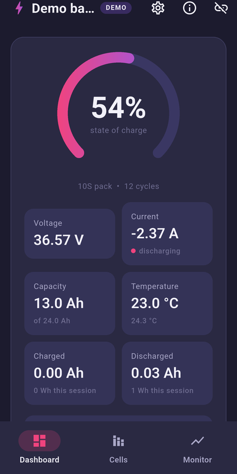
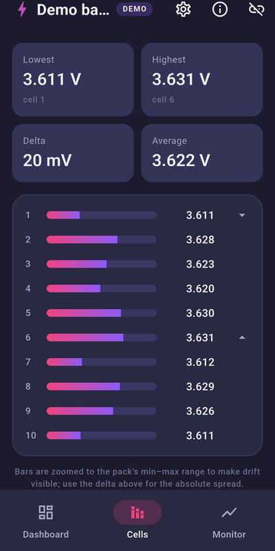
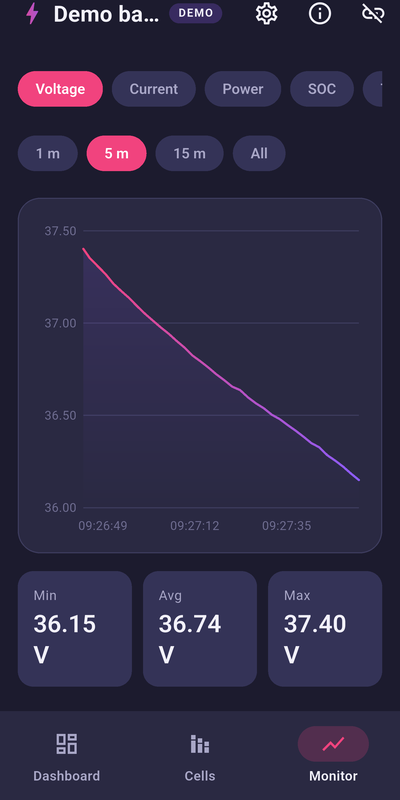
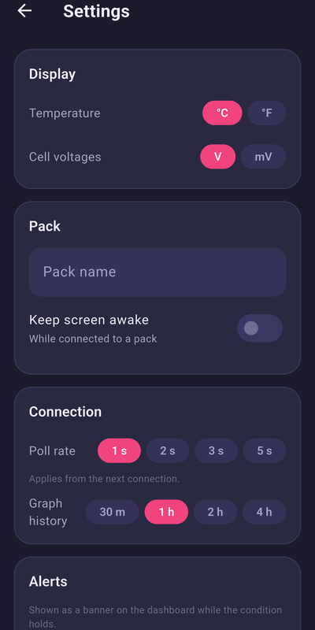
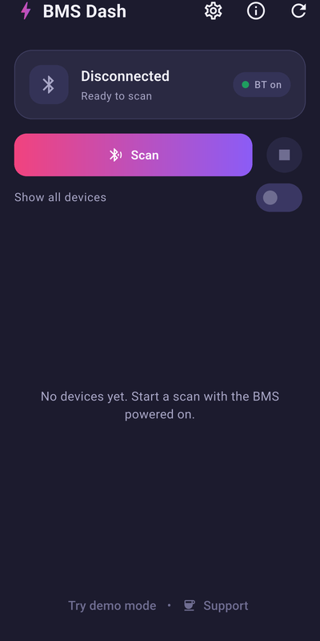

# ⚡ BMS Dash

A modern Android dashboard for **JBD / Xiaoxiang smart BMS** (battery
management systems) over Bluetooth LE — state of charge, per-cell voltages,
live graphs, alerts, and MOSFET control in a dark, glanceable UI.

Free for personal use. If it saves your pack, consider buying me a coffee. ☕

<a href="https://buymeacoffee.com/invertium"></a>

<p align="center">
  
  
  
  
  
</p>

## Features

- **Dashboard** — radial SOC gauge, pack voltage/current/capacity/temperature
  tiles, decoded protection warnings, session charge/discharge energy
  (Ah / Wh), device info (hardware/software version, production date,
  cycles), and a single hardened toggle for the charge + discharge MOSFETs
  (confirm-and-retry against telemetry, confirmation prompt before cutting
  power).
- **Cells** — one bar per cell with relative zoom so a 20 mV drift is
  obvious, min/max/delta/average stats, and live balancing indicators.
- **Monitor** — smooth gradient time-series graphs for voltage, current,
  power, SOC, and temperature with 1 m / 5 m / 15 m / All windows and touch
  tooltips.
- **Alerts** — optional thresholds for low/high SOC, cell imbalance, and
  temperature; a banner appears on the dashboard while a condition holds.
- **Settings** — °C/°F, cell voltages in V or mV, poll rate, graph history
  window (30 min – 4 h), a custom pack name, and keep-screen-awake. All
  persisted on-device.
- **Connectivity** — BMS-first device filtering, auto-reconnect to the last
  pack on launch, and a stale-data watchdog that tears the session down
  instead of showing frozen values.
- **Demo mode** — a built-in simulated 10S pack, so you can explore every
  screen without hardware (it drives the exact same code paths).

Tested against a JBD **SP17S005P17S80A** (10S LiFePO₄/Li-ion configurations).
Any BMS speaking the JBD/Xiaoxiang UART-over-BLE protocol (GATT service
`0xFF00`) should work.

## Getting it

- **Google Play** — coming soon (in testing).
- **GitHub releases** — signed APKs on the
  [releases page](https://github.com/invertium/bms-dash/releases).
- **Build it yourself** — see [Building](#building) below.

## Safety

The app is read-mostly by design: the **only** write it ever sends is the
volatile MOSFET on/off command (register `0xE1`). It never enters factory
mode and never touches EEPROM/protection settings, and the BMS's hardware
protections stay active regardless of what the app does. Still: this
software comes **without any warranty** (see [LICENSE](LICENSE)) — you are
working with hardware that manages a battery; keep the pack's limits in
mind.

## Privacy

BMS Dash collects nothing. It has no `INTERNET` permission, so it cannot
phone home even in principle; Bluetooth is used only to talk to your BMS,
and settings stay on your device. Details in [PRIVACY.md](PRIVACY.md).

## Building

Everything runs in Docker — no local Flutter/Android SDK needed, only
`docker` (with the compose plugin) and `adb` on the host:

```sh
make deps      # flutter pub get
make analyze   # static analysis
make test      # unit + widget tests
make apk       # debug APK -> build/app/outputs/flutter-apk/app-debug.apk
```

Install on a USB-connected phone with `make install-debug`, or use the
containerized Android emulator (`make emulator`, then
`adb connect localhost:5555`) together with demo mode — the emulator has no
Bluetooth, demo mode covers that. See
[docs/host-tools.md](docs/host-tools.md) for host-side adb notes.

### Release builds

Release builds are signed with the keystore referenced by
`android/key.properties` (not in version control). Without it, release
builds fail on purpose — a release artifact never silently carries the
debug signature. Fresh clones can still build and install debug APKs:

```sh
docker compose run --rm flutter flutter build apk --release
```

## How the code is organized

| Where | What |
| --- | --- |
| `lib/jbd_bms.dart` | JBD frame codec + BLE session (polling, watchdog, MOSFET confirm-and-retry) |
| `lib/demo_bms.dart` | Simulated 10S pack implementing the same session interface |
| `lib/ble.dart` | Scanner/connection abstraction over `flutter_blue_plus` |
| `lib/bms_state.dart` | Riverpod state: telemetry history, session energy, alerts, reconnect |
| `lib/settings.dart` | Persisted settings + alert threshold evaluation |
| `lib/screens/` | Connect, dashboard, cells, monitor, and settings screens |
| `lib/theme.dart`, `lib/widgets.dart` | Dark navy + pink/purple design system |
| `test/` | Protocol golden frames, settings/alert/energy logic, widget smoke test |

### Protocol

The JBD frame codec lives in [`lib/jbd_bms.dart`](lib/jbd_bms.dart) with
golden-frame tests in [`test/jbd_bms_test.dart`](test/jbd_bms_test.dart):
basic info (`0x03`), cell voltages (`0x04`), hardware version (`0x05`), and
MOSFET control (`0xE1`), including balance bits, protection-status decoding,
and the software-FET-lock quirk (bit 12 is set by the off command and is not
a fault).

## Roadmap

See [ROADMAP.md](ROADMAP.md) for planned features.

## License

[PolyForm Noncommercial 1.0.0](LICENSE): use, study, modify, and share the
software freely for any noncommercial purpose; commercial use needs
separate permission from the copyright holder. Version 1.0.0 was released
under MIT and stays MIT. Official builds come from this repository's
releases and the official Play listing.

Contributions are welcome; by opening a PR you agree that your contribution
is licensed under the project license and may be relicensed by the
maintainer. Bundled dependency licenses are viewable in-app under
*About → Open-source licenses*.
